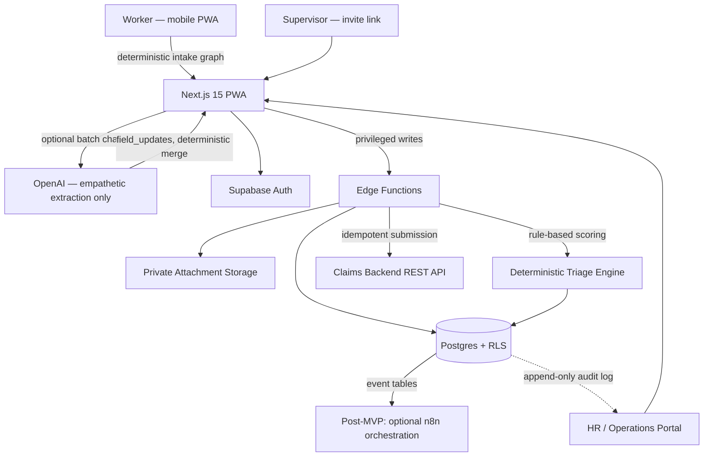

# WC FNOL Copilot (Showcase)

> Part of [`insurance-ai-lab`](https://github.com/mishraabhishek1218/insurance-ai-lab) — Claims domain, cross-LOB extension (P1).

**This is a trimmed, public showcase of a proprietary product.** Full source is private. This repo contains architecture notes, a demo link (if available), and illustrative code snippets only — not the working application. See [LICENSE.md](./LICENSE.md).

**Smart Injury Intake & Triage for Workers' Compensation** — a mobile-first digital copilot that turns fragmented First Notice of Loss (FNOL) intake into one auditable incident record.

## Problem

Every workers' compensation claim begins with a First Notice of Loss — the moment an injured employee, their supervisor, and HR must capture what happened, how serious it is, and whether the organization can respond quickly and compliantly. At most employers and TPAs today, that process is slow, inconsistent, and scattered across phone calls, paper forms, email threads, and siloed systems — driving delayed care routing, rework for adjusters, compliance risk, and a poor experience for workers reporting an injury while in pain or under stress.

WC FNOL Copilot is not a generic chatbot and not a full claims system — it's a purpose-built intake and triage layer that helps every stakeholder (worker, supervisor, HR) contribute to one canonical incident record before a claim moves downstream.

## Approach

- **Worker & supervisor experience (mobile-first):** deterministic intake graphs guide workers step-by-step, with optional empathetic AI batch chat that extracts many fields from one message, review-before-submit, local draft persistence for offline/spotty connectivity, and photo upload. Supervisors supplement via secure invite links without a full account setup.
- **HR & operations portal:** structured verification, completeness scoring, rule-based triage tiers, an incident inbox, printable summaries, and FNOL submission readiness — so HR knows what's missing before a payload goes out.
- **Backend & security posture:** row-level security on every tenant table, append-only audit events, private attachment storage, Edge Functions for privileged writes, notification orchestration, and per-account integration configs.
- **Design principle:** the conversation is UI, the incident record is truth — every critical value maps to a typed field, validation, a review screen, and an audit log, especially where AI is involved. Structured fields, validation, and triage scoring stay deterministic and explainable; the LLM only phrases things empathetically.

## Tech Stack

- **Frontend:** Next.js 15 (React 19) Progressive Web App, mobile-first
- **Backend:** Supabase — Postgres with row-level security, Auth, Storage, Edge Functions
- **Domain layer:** shared TypeScript domain package (`packages/domain`) with Zod schemas and business rules, consumed by the web app and test suite
- **Monorepo:** pnpm workspaces (`apps/web`, `packages/domain`, `packages/ui`, `packages/config`, `tests`)
- **AI:** optional OpenAI-assisted intake guide (empathetic batch chat), layered on top of deterministic state machines — not a dependency for core functionality
- **Testing:** 80+ automated tests across domain logic, integration contracts, RLS policies, and end-to-end flows

## Live Demo

In development — live demo coming soon.

## Architecture

The MVP is a lean, LLM-optional stack: a Next.js PWA talks directly to Supabase (Auth, Postgres+RLS, Storage, Edge Functions), with Edge Functions handling privileged writes, email notifications, and submission to the claims backend REST API. Event tables for notifications and submission attempts are written from day one so a post-MVP orchestration layer (optional n8n) can consume them without schema changes. Multi-tenant isolation is enforced via RLS rather than application-layer checks, and every submission is idempotent with a full retry/status history.

## Code samples

Three small excerpts from the domain layer, chosen to show the design principles above in code rather than just prose:

- [`snippets/score-triage.ts`](./snippets/score-triage.ts) — the rule-based triage engine: no LLM, fully auditable, produces a tier + human-readable flags
- [`snippets/merge-field-updates.ts`](./snippets/merge-field-updates.ts) — the deterministic boundary between LLM-extracted chat fields and the canonical incident record
- [`snippets/fnol-payload-schema.ts`](./snippets/fnol-payload-schema.ts) — the Zod schema every FNOL submission is validated against before it can reach the claims backend

---

© 2026 Abhishek Mishra. All rights reserved.
